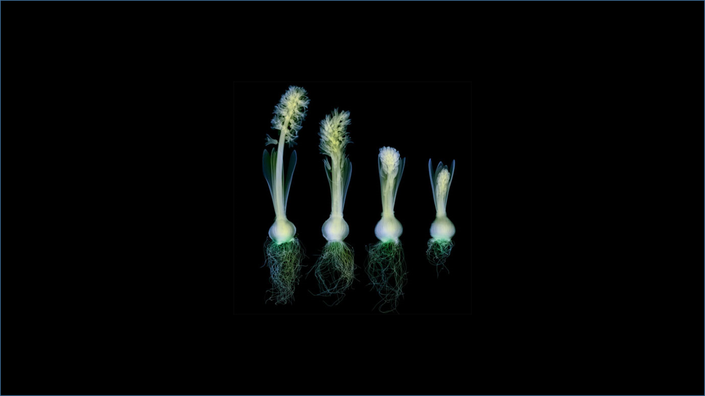

```{r setup, include=FALSE}
knitr::opts_chunk$set(echo = TRUE)
```

## Hyacinthus


Hyacinthus is a small genus of bulbous, fragrant flowering plants in the family Asparagaceae, subfamily Scilloideae.[1] These are commonly called hyacinths /ˈhaɪəsɪnθs/. The genus is native to the eastern Mediterranean (from the south of Turkey through to northern Israel).[2]
Several species of Brodiea, Scilla, and other plants that were formerly classified in the lily family and have flower clusters borne along the stalk also have common names with the word "hyacinth" in them. Hyacinths should also not be confused with the genus Muscari, which are commonly known as grape hyacinths.

**Kingdom:**	Plantae
**Clade:**	Angiosperms
**Clade:**	Monocots
**Order:**	Asparagales
**Family:**	Asparagaceae
**Subfamily:**	Scilloideae
_**Genus:**_ Hyacinthus
_**Tourn.**_ ex L.


* item 1
  + sub item 1
* item 2
  + sub item 2
* item 3
  + sub item 3

## Images



```{r cars}
summary(cars)
```

## Including Plots

You can also embed plots, for example:

```{r pressure, echo=FALSE}
plot(pressure)
```

Note that the `echo = FALSE` parameter was added to the code chunk to prevent printing of the R code that generated the plot.
